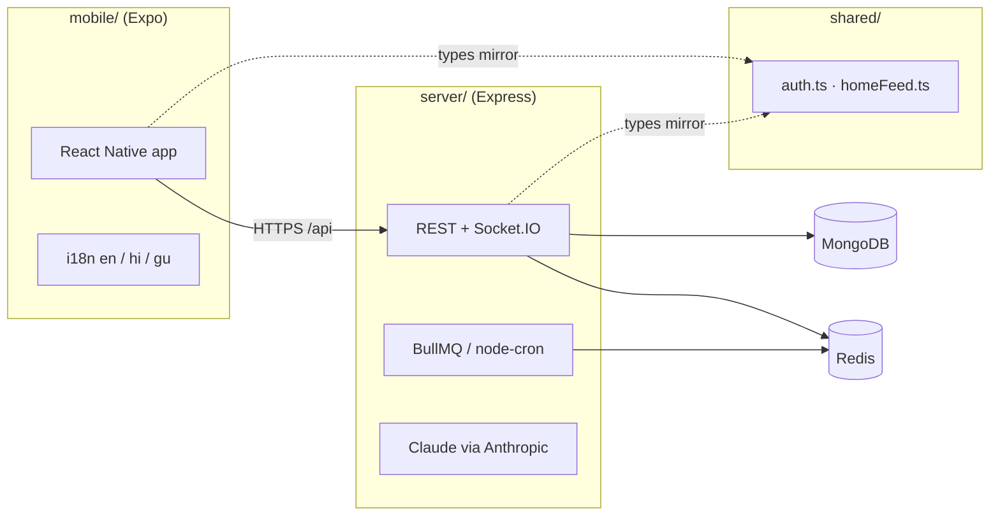

# Sopaan

Sopaan is an AI-powered government exam preparation platform for Indian students — personalized study plans, practice tests, current affairs, live classes, and an AI doubt solver, delivered through a React Native (Expo) app backed by a Node.js API.

This repository is an **npm workspaces monorepo** with three packages:

| Package | Path | Role |
| ------- | ---- | ---- |
| **API** | [`server/`](server/) | Express 5 REST API, MongoDB, background jobs, Socket.IO realtime |
| **Mobile** | [`mobile/`](mobile/) | Expo SDK 53 app (React Native, TypeScript) |
| **Shared** | [`shared/`](shared/) | Cross-package TypeScript contracts (auth profile, home feed shapes) |



## What ships today

**Mobile (main tabs):** Home feed · Practice · Current Affairs · Profile

**Learning & prep:** AI-generated tests · mock / sectional / PYQ practice · quiz + results with AI coach · mock analysis · flashcards (SM-2) · study planner · focus timer · courses & books · revision capsules · vocabulary · exam calendar

**AI:** Ask AI doubt solver · answer evaluation · semantic similar-question search (optional embeddings)

**Engagement:** Daily challenges · streaks & leagues · leaderboards · learning games · rewards & badges · referrals · Sopaan Pro (Razorpay)

**Content:** Current affairs (NewsAPI.ai + optional RSS digest) · live classes (LiveKit) · community tests · mentors · forum / groups

**Platform:** OTP + password auth · Google Sign-In · push notifications · en / hi / gu UI · admin content tools · EAS OTA updates · Sentry

**Server:** REST under `/api/*`, health at `/api/health`, background jobs (daily plan, streak reminders, CA digest, league maintenance, observability checks). See [`server/src/routes/index.js`](server/src/routes/index.js) for the full route map.

---

## Prerequisites

- **Node.js** 20+ and **npm** 10+ (workspaces)
- **MongoDB** 7 locally, Atlas, or via Docker (see below)
- **Redis** optional for local dev (recommended; enables cache, rate limits, and BullMQ jobs)
- **Expo Go** on a device, or Xcode / Android Studio for simulators
- **EAS CLI** (`npm i -g eas-cli`) only when building or publishing mobile releases

---

## Quick start (local dev)

### 1. Clone and install

```bash
git clone <repo-url> mk-ai && cd mk-ai
npm install
```

### 2. Configure the API

```bash
cp server/.env.example server/.env
```

Edit [`server/.env`](server/.env). Minimum for local development:

| Variable | Example | Notes |
| -------- | ------- | ----- |
| `MONGODB_URI` | `mongodb://127.0.0.1:27017/sopaan` | Local or Atlas |
| `JWT_SECRET` | random string ≥ 32 chars | |
| `JWT_REFRESH_SECRET` | different random string ≥ 32 chars | |
| `CLIENT_URL` | `http://localhost:8081` | Expo dev server (CORS) |
| `DEV_STUB_AI` | `true` | **Required for local dev without Anthropic** — deterministic AI stubs; server refuses this in production |

Full reference: [`server/.env.example`](server/.env.example)

Optional: `REDIS_URL=redis://127.0.0.1:6379` and `REDIS_ENABLED=true` for Redis-backed cache and jobs.

### 3. Start MongoDB (pick one)

**Docker Compose** (API + MongoDB + Redis + BullMQ worker):

```bash
cp server/.env.docker.example server/.env.docker   # optional overrides
docker compose up --build
```

See [`server/docs/DEPLOY.md`](server/docs/DEPLOY.md) for container details.

**Or** run MongoDB yourself (Homebrew, Atlas, etc.) and continue with step 4.

### 4. Seed sample data

```bash
npm run seed -w @sopaan/server
```

Creates exams, tests, current affairs, courses, and dev users (password `Password123!`):

| Email | Role |
| ----- | ---- |
| `student@sopaan.dev` | Student (onboarded — good for quick login) |
| `admin@sopaan.dev` | Admin |
| `mentor@sopaan.dev` | Mentor |

### 5. Run the API

```bash
npm run dev -w @sopaan/server
```

Listens on **http://localhost:4000** (`PORT` in `.env`). Verify:

```bash
curl -s http://localhost:4000/api/health | jq
```

With `DEV_STUB_AI=true`, Claude is not called — AI endpoints return deterministic stubs.

### 6. Run the mobile app

```bash
npm run start -w @sopaan/mobile
```

Press `i` (iOS simulator), `a` (Android emulator), or scan the QR code with Expo Go.

**API URL resolution** ([`mobile/src/config/env.ts`](mobile/src/config/env.ts)):

1. `EXPO_PUBLIC_API_URL` if set in [`mobile/.env`](mobile/.env) (copy from [`mobile/.env.example`](mobile/.env.example))
2. Android emulator → `http://10.0.2.2:4000`
3. Physical device → your machine's LAN IP on port 4000 (set `EXPO_PUBLIC_API_URL=http://192.168.x.x:4000` if auto-detect fails)

### 7. Core dev loop

1. **Log in** — email `student@sopaan.dev` / password `Password123!` (email sign-in; phone/OTP coming in a later release).
2. **Home** — personalized feed, streak, daily challenge, recommended tests.
3. **Practice** — start a seeded mock test or tap **Generate with AI** (stubbed when `DEV_STUB_AI=true`).
4. **Quiz → Result** — answer questions, submit, review score and **AI coach** feedback.
5. **Ask AI** — floating action or Home quick action → doubt solver.
6. **Profile** — stats, settings, language (English / Hindi / Gujarati).

---

## The `shared/` package

[`shared/`](shared/) holds **API contracts** used by both stacks so mobile and server stay aligned:

| Export | Purpose |
| ------ | ------- |
| `@sopaan/shared/auth` | `Profile`, `AuthResult`, `ProfileLanguage` (`en` \| `hi` \| `gu`) |
| `@sopaan/shared/homeFeed` | `HomeFeed` shape returned by `GET /api/home` |
| `*.constants.js` | Shared constants (e.g. home quick-action keys) |

Mobile imports these from `shared/` (see [`mobile/src/types/auth.ts`](mobile/src/types/auth.ts)). The server mirrors the same shapes in serializers and JSDoc. **Add new cross-boundary types here** rather than duplicating in each package.

---

## Environment files

| File | Package | Use |
| ---- | ------- | --- |
| [`server/.env.example`](server/.env.example) | API | Local dev template |
| [`server/.env.staging.example`](server/.env.staging.example) | API | Staging secrets checklist |
| [`server/.env.docker.example`](server/.env.docker.example) | API | Docker Compose overrides |
| [`mobile/.env.example`](mobile/.env.example) | Mobile | `EXPO_PUBLIC_*` client config |
| [`mobile/.env.staging.example`](mobile/.env.staging.example) | Mobile | Point at staging API |
| [`mobile/.env.e2e.example`](mobile/.env.e2e.example) | Mobile | Maestro / CI E2E |

Never commit `.env` files with real secrets.

### Production API

`NODE_ENV=production` triggers strict env validation at boot (Anthropic, Razorpay, NewsAPI.ai, Sentry, etc.). **Never set `DEV_STUB_AI=true` in production.**

Details: [`server/docs/STAGING.md`](server/docs/STAGING.md) · [`server/docs/DEPLOY.md`](server/docs/DEPLOY.md) (Docker, Render / Railway / Fly, BullMQ `worker` process)

---

## Tests

From the repo root:

```bash
# Everything
npm test

# API only (Jest, in-band)
npm run test -w @sopaan/server

# Mobile only (Jest + React Native Testing Library)
npm run test -w @sopaan/mobile

# Mobile typecheck
npm run typecheck

# Mobile i18n hardcoded-string check (priority screens)
npm run i18n:check -w @sopaan/mobile

# Lint + format
npm run lint
npm run format:check
```

**E2E (Maestro):** build a dev APK/IPA, then `npm run e2e:maestro -w @sopaan/mobile`. See [`mobile/docs/E2E.md`](mobile/docs/E2E.md). CI runs Maestro on Android in [`.github/workflows/e2e-mobile.yml`](.github/workflows/e2e-mobile.yml).

---

## Mobile: EAS build & deploy

Native binaries and OTA updates go through [Expo Application Services](https://expo.dev/eas).

### One-time setup

```bash
npm i -g eas-cli
eas login
cd mobile && eas init    # link Expo project; set EAS_PROJECT_ID in mobile/.env
```

### Build profiles (`mobile/eas.json`)

| Profile | Channel | API (`EXPO_PUBLIC_API_URL`) | Purpose |
| ------- | ------- | ----------------------------- | ------- |
| `development` | `development` | local / dev client | Internal dev builds |
| `staging` | `staging` | `https://staging-api.sopaan.app` | QA |
| `production` | `production` | `https://api.sopaan.app` | Store release |
| `e2e-android` / `e2e-ios` | `e2e` | CI stub API | Maestro CI |

**EAS secrets** (dashboard or `eas secret:create`): `SENTRY_AUTH_TOKEN`, `EXPO_PUBLIC_SENTRY_DSN`, `EAS_PROJECT_ID`.

### Ship a store build

```bash
cd mobile
eas build --profile staging --platform android
eas build --profile production --platform all
eas submit --profile production --platform android   # after build completes
```

### Ship a JS-only fix (OTA, no store review)

Same `app.json` version / native deps only:

```bash
cd mobile
npm run update:staging -- "fix: quiz timer edge case"
npm run update:production -- "fix: quiz timer edge case"
```

Staged rollout: `npm run update:rollout-10` → `update:rollout-50` → full production. Rollback: `npm run update:rollback`.

Full release playbook: [`mobile/docs/RELEASES.md`](mobile/docs/RELEASES.md)

---

## Project layout

```
.
├── server/                 # @sopaan/server — Express API
│   ├── src/
│   │   ├── routes/         # REST routers
│   │   ├── services/       # Business logic
│   │   ├── jobs/           # BullMQ + node-cron schedulers
│   │   ├── models/         # Mongoose schemas
│   │   └── seed/           # npm run seed
│   ├── Dockerfile
│   └── docs/               # DEPLOY, STAGING, SECURITY, …
├── mobile/                 # @sopaan/mobile — Expo app
│   ├── src/
│   │   ├── screens/        # UI screens
│   │   ├── navigation/     # React Navigation stacks/tabs
│   │   ├── api/            # Axios client
│   │   └── i18n/           # Locales (en, hi, gu)
│   ├── eas.json            # EAS build/update profiles
│   ├── .maestro/           # Maestro E2E flows
│   └── docs/               # RELEASES, E2E, LOCALIZATION, …
├── shared/                 # @sopaan/shared — cross-package types
├── docker-compose.yml      # Local API + MongoDB + Redis + worker
└── package.json            # Root workspace scripts
```

---

## Further reading

| Doc | Topic |
| --- | ----- |
| [`server/docs/DEPLOY.md`](server/docs/DEPLOY.md) | Docker, production deploy, `PROCESS_ROLE`, BullMQ worker |
| [`server/docs/STAGING.md`](server/docs/STAGING.md) | Staging environment |
| [`mobile/docs/RELEASES.md`](mobile/docs/RELEASES.md) | OTA updates, rollouts, force-update gate |
| [`mobile/docs/LOCALIZATION.md`](mobile/docs/LOCALIZATION.md) | i18n namespaces and adding locales |
| [`mobile/docs/E2E.md`](mobile/docs/E2E.md) | Maestro flows |
| [`server/docs/SECURITY.md`](server/docs/SECURITY.md) | Auth, rate limits, secrets |

---

## License

Private — all rights reserved.
